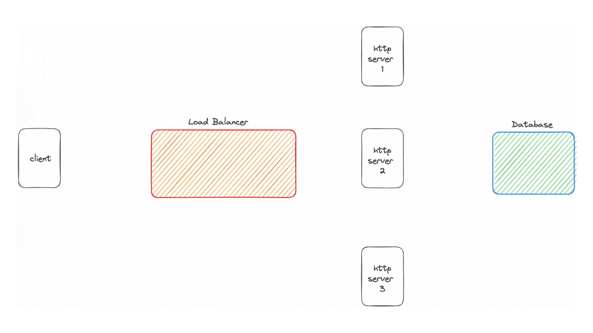

# An implementation of a Scaled WebSocket Architecture

## _Motivation_

<!--  -->

    

## Why are _WebSockets_ difficult to _Scale_ ?

In the traditional [**Client-Server model**](https://en.wikipedia.org/wiki/Client%E2%80%93server_model), the client communicates with the server
via the [**HTTP protocol**](https://datatracker.ietf.org/doc/html/rfc2616). This consists of _**request-response**_ pairs. A _**three way handshake**_ happens establishing a [**TCP**](https://www.ietf.org/rfc/rfc793.txt) connection. Post the TCP connection, HTTP _request-response_
pairs are transmitted between the client and server.

### HTTP _request-response_ pairs

### HTTP is a stateless protocol

However, this way of communication is _**stateless**_, since one client can request to multiple HTTP servers and the client state need not be stored in the server. Therefore, millions of clients can be served independently across multiple HTTP servers that are load balanced by reverse proxy servers. Therefore, **HTTP servers are horizontally scalable**.

### NOTE

However, note that a typical HTTP server cannot, on its own, initiate a communication. It can only respond back to the incoming request initiated by a client. Hence, the server cannot broadcast or issue **Server Sent Events** simply because the server just does not know the state of the client.

### WebSocket is a stateful protocol

However, in case of a [**WebSocket protocol**](https://datatracker.ietf.org/doc/html/rfc6455), **one client is bound to a single WebSocket server** and the WebSocket server knows the state of the client. The server can **broadcast** or **multicast** events that are initiated from the server itself. This can happen simply because the way of communication is **stateful** and the server knows the state of the client. This helps in _low latency_ real time communications between the client and the server. Now, **a loss of connection implies the loss of state**.

Note that one client ideally binds to one WebSocket server and this server maintains the state of the client. However, just **simply scaling the WebSocket severs horizontally cannot replicate the states across the multiple WebSocket servers** and vertically scaling a WebSocket server is capped by hardware limitations.

## _This #PR resolves #RP_

### Architecture

### Load Balancing and Pub-Sub

### Replicating the states across multiple WebSocket Severs

